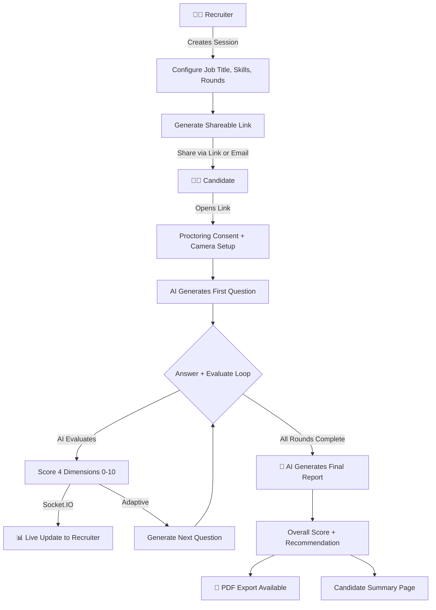

<div align="center">

# 🧠 InterviewIQ

### AI-Powered Intelligent Interview Simulation Platform

[](https://nodejs.org/)
[](https://react.dev/)
[](https://www.mongodb.com/atlas)
[](https://ai.google.dev/)
[](https://socket.io/)
[](LICENSE)

**InterviewIQ** revolutionizes the recruitment process by enabling recruiters to create structured, AI-driven interview sessions. Candidates are evaluated in real-time across multiple dimensions — with adaptive questioning, live proctoring, and intelligent scoring — all powered by Google Gemini AI.

[🚀 Live Demo](#-deployment) · [📖 Documentation](#-project-overview) · [🐛 Report Bug](../../issues) · [💡 Request Feature](../../issues)

</div>

---

## 📖 Project Overview

**InterviewIQ** is a full-stack web application built during **Hack & Forge 2026** that simulates enterprise-grade interview experiences using AI. It bridges the gap between recruiters and candidates by automating the entire interview lifecycle — from creating role-specific sessions to generating comprehensive hiring reports.

### 🎯 Problem It Solves

| Challenge | How InterviewIQ Addresses It |
|---|---|
| **Time-consuming screening** | AI conducts structured interviews 24/7, freeing recruiter time |
| **Inconsistent evaluations** | Standardized scoring across 4 dimensions ensures objectivity |
| **Candidate cheating** | Built-in AI proctoring with face detection, tab monitoring & trust scoring |
| **Lack of depth** | Adaptive questioning adjusts difficulty based on candidate performance |
| **Delayed feedback** | Real-time score updates via WebSocket; instant PDF reports |

---

## ✨ Key Features

### 🔐 Authentication & Roles
- **JWT-based** authentication with secure password hashing (bcrypt)
- **Google OAuth 2.0** one-click sign-in
- **Two distinct roles**: Recruiter (creates & manages) and Candidate (takes interviews)
- **Quick registration** — candidates can join with just their name via a shared link

### 📋 Interview Session Configuration *(Recruiter)*
- Create sessions with **job title**, **required skills** (multi-tag input), and **experience level**
- Select interview **rounds**: Introduction → Technical → Managerial
- Configure **questions per round** (1–10) and **session time limit**
- Generate a **unique shareable interview link** with one click
- **Email invitations** — send interview links directly to candidates via Gmail integration

### 🤖 AI Interview Engine *(Core Intelligence)*
- **Dynamic question generation** powered by Google Gemini AI
- **Adaptive difficulty** — if a candidate scores high, questions get harder; shallow answers trigger follow-up drill-downs
- **Context-aware** — AI remembers the full conversation history (last 5 Q&A pairs) for coherent progression
- **Multi-round structure**: Intro → Technical → Managerial with smooth transitions
- **Multi-model fallback** — automatically tries multiple Gemini models if one is unavailable

### 📝 Real-Time Response Evaluation
Every answer is scored across **4 dimensions** (0–10 each):

| Dimension | What It Measures |
|---|---|
| **Technical Relevance** | Does the answer match the question's domain? |
| **Depth & Completeness** | Surface-level or detailed explanation? |
| **Clarity & Communication** | Well-structured and readable? |
| **Accuracy** | Technically and factually correct? |

### 🛡️ AI Proctoring & Anti-Cheating
- **Face detection** via MediaPipe — detects missing face, multiple faces, or looking away
- **Tab switch monitoring** — logs every window/tab change with penalties
- **Copy/paste & DevTools disabled** — keyboard shortcuts and right-click blocked
- **Timing analysis** — suspiciously fast answers are flagged
- **Trust Score** — starts at 100% and decreases with each violation
- **Camera & audio monitoring** — continuous live feed during the interview

### 📊 Live Recruiter Dashboard
- Real-time candidate progress via **Socket.IO** WebSocket updates
- Watch answer history and running scores as they happen
- View AI-generated evaluation notes per answer
- Status badges: `Pending` → `Ongoing` → `Completed`
- Manage all sessions from a centralized dashboard

### 📈 Post-Interview Analytics & Reporting
- **Radar chart** visualization of dimension scores (Recharts)
- **Overall score** out of 100 with color-coded severity
- **AI Recommendation**: `HIRE` / `HOLD` / `REJECT` with reasoning
- **AI-written summary** paragraph for each candidate
- **Proctoring report** — trust score, tab switches, copy/paste attempts, and event logs
- **Full interview transcript** — expandable Q&A accordion with per-answer scores
- **PDF export** — download professional reports via jsPDF

### 🎙️ Accessibility Features
- **Voice input** — speak your answers using Web Speech API
- **Text-to-Speech** — AI questions are read aloud to the candidate
- **Mobile responsive** design across all pages

---

## 🏗️ System Architecture

```
┌──────────────────────────────────────────────────────────────────┐
│                     FRONTEND (React 19 + Vite 8)                 │
│  ┌────────────┐  ┌──────────────────┐  ┌──────────────────────┐ │
│  │ Auth Pages │  │ Interview UI     │  │ Recruiter Dashboard  │ │
│  │ (Login,    │  │ (Chat, Timer,    │  │ (Sessions, Reports,  │ │
│  │  Register, │  │  Proctoring,     │  │  Live Updates,       │ │
│  │  Google    │  │  Voice I/O)      │  │  PDF Export)         │ │
│  │  OAuth)    │  │                  │  │                      │ │
│  └────────────┘  └──────────────────┘  └──────────────────────┘ │
└───────────────────────────┬──────────────────────────────────────┘
                            │ REST API + Socket.IO (WebSocket)
┌───────────────────────────▼──────────────────────────────────────┐
│                  BACKEND (Node.js + Express 5)                   │
│  ┌──────────────┐  ┌──────────────────┐  ┌───────────────────┐  │
│  │ Auth Service │  │ Session Service  │  │ AI Service        │  │
│  │ (JWT+Google  │  │ (CRUD, Tokens,   │  │ (Gemini API,      │  │
│  │  OAuth)      │  │  Proctoring)     │  │  Multi-model      │  │
│  │              │  │                  │  │  fallback)        │  │
│  └──────────────┘  └──────────────────┘  └───────────────────┘  │
│  ┌──────────────┐  ┌──────────────────┐  ┌───────────────────┐  │
│  │ Score Engine │  │ Socket Manager   │  │ Email Service     │  │
│  │ (Aggregation │  │ (Real-time push  │  │ (Nodemailer +     │  │
│  │  + Analytics)│  │  to recruiters)  │  │  Gmail SMTP)      │  │
│  └──────────────┘  └──────────────────┘  └───────────────────┘  │
└───────────────────────────┬──────────────────────────────────────┘
                            │
              ┌─────────────┴─────────────┐
              │       MongoDB Atlas       │
              │  Users │ Sessions │ Ans.  │
              │  Reports │ Proctoring     │
              └─────────────┬─────────────┘
                            │
                 ┌──────────┴──────────┐
                 │   Google Gemini AI  │
                 │   (gemini-flash /   │
                 │    gemini-pro /     │
                 │    2.0-flash-lite)  │
                 └─────────────────────┘
```

---

## 🛠️ Tech Stack

### Frontend
| Technology | Purpose |
|---|---|
| **React 19** | UI framework with hooks-based architecture |
| **Vite 8** | Lightning-fast HMR and build tooling |
| **React Router v7** | Client-side routing with protected routes |
| **Zustand** | Lightweight state management |
| **Framer Motion** | Smooth page transitions and micro-animations |
| **Recharts** | Radar chart for score visualization |
| **Socket.IO Client** | Real-time WebSocket communication |
| **MediaPipe (Tasks-Vision)** | Face detection for proctoring |
| **Web Speech API** | Voice input and text-to-speech |
| **jsPDF** | Client-side PDF report generation |
| **Lucide React** | Modern icon library |
| **React Hot Toast** | Elegant toast notifications |

### Backend
| Technology | Purpose |
|---|---|
| **Node.js 18+** | JavaScript runtime |
| **Express 5** | Web server framework |
| **MongoDB + Mongoose 9** | NoSQL database with ODM |
| **Google Gemini AI** | LLM-powered question generation & evaluation |
| **Socket.IO** | Real-time bidirectional communication |
| **JWT + bcryptjs** | Stateless authentication & password hashing |
| **Google Auth Library** | OAuth 2.0 token verification |
| **Nodemailer** | Email invitation delivery (Gmail SMTP) |
| **nanoid** | Unique shareable token generation |

### Design System
| Token | Value |
|---|---|
| Primary Background | `#0A0A1A` (deep dark navy) |
| Card Background | `rgba(26, 26, 50, 0.8)` with glassmorphism |
| Accent Primary | `#6C63FF` (electric indigo) |
| Accent Secondary | `#00D4FF` (cyan) |
| Font | [Inter](https://fonts.google.com/specimen/Inter) (Google Fonts) |
| Effects | Glassmorphism, gradient borders, glow animations |

---

## 📁 Project Structure

```
InterviewIQ/
├── backend/
│   ├── config/
│   │   └── db.js                     # MongoDB Atlas connection
│   ├── controllers/
│   │   ├── auth.controller.js        # Register, Login, Google OAuth, Quick-register
│   │   ├── candidate.controller.js   # Candidate-specific operations
│   │   ├── interview.controller.js   # Join, Submit Answer, Complete Interview
│   │   └── session.controller.js     # CRUD sessions, Send email invites
│   ├── middleware/
│   │   └── auth.middleware.js        # JWT verification middleware
│   ├── models/
│   │   ├── User.model.js            # User schema (recruiter/candidate)
│   │   ├── Session.model.js         # Session schema + proctoring logs
│   │   ├── Answer.model.js          # Individual answer with scores
│   │   └── Report.model.js          # Final aggregated report
│   ├── routes/
│   │   ├── auth.routes.js
│   │   ├── candidate.routes.js
│   │   ├── interview.routes.js
│   │   └── session.routes.js
│   ├── services/
│   │   ├── ai.service.js            # Gemini API wrapper (multi-model fallback)
│   │   ├── email.service.js         # Nodemailer integration
│   │   └── score.service.js         # Score aggregation logic
│   ├── socket/
│   │   └── socket.js               # Socket.IO setup & room management
│   ├── .env.example
│   ├── package.json
│   └── server.js                    # Express app + Socket.IO + static serving
│
├── frontend/
│   ├── src/
│   │   ├── components/
│   │   │   ├── Navbar.jsx           # Navigation bar with auth state
│   │   │   ├── ProtectedRoute.jsx   # Role-based route protection
│   │   │   ├── RoundProgress.jsx    # Visual round progression indicator
│   │   │   ├── ScoreRadarChart.jsx  # Recharts radar for dimensions
│   │   │   └── SendLinkModal.jsx    # Email invitation modal
│   │   ├── pages/
│   │   │   ├── LoginPage.jsx        # Login with email + Google OAuth
│   │   │   ├── RegisterPage.jsx     # Register with role selection
│   │   │   ├── RecruiterDashboard.jsx  # Session management table
│   │   │   ├── CreateSessionPage.jsx   # Multi-step session creator
│   │   │   ├── InterviewPage.jsx    # Full interview UI + proctoring (888 lines)
│   │   │   ├── CandidateDashboard.jsx  # Candidate's past interviews
│   │   │   ├── CandidateSummary.jsx    # Post-interview score summary
│   │   │   ├── CandidatesPage.jsx      # Recruiter view of all candidates
│   │   │   └── SessionReport.jsx       # Detailed report + PDF export
│   │   ├── context/AuthContext.jsx  # React Context for auth state
│   │   ├── hooks/useSocket.js       # Socket.IO custom hook
│   │   ├── lib/axios.js             # Axios instance with JWT interceptor
│   │   ├── store/useSessionStore.js # Zustand store
│   │   ├── App.jsx                  # Route definitions
│   │   ├── main.jsx                 # Entry point
│   │   └── index.css                # Design system (CSS variables, glassmorphism)
│   ├── .env.example
│   ├── package.json
│   └── vite.config.js
│
├── build.sh                         # Production build script
├── render.yaml                      # Render.com blueprint for one-click deploy
├── vercel.json                      # Vercel SPA rewrite config
└── README.md
```

---

## ⚡ Getting Started

### Prerequisites

- **Node.js** v18 or higher
- **MongoDB Atlas** account (free tier works)
- **Google Gemini API Key** — [Get one here](https://aistudio.google.com/app/apikey)
- *(Optional)* Google OAuth credentials for social login
- *(Optional)* Gmail App Password for email invitations

### 1️⃣ Clone the Repository

```bash
git clone https://github.com/Yash122005/AI_INTERVIEWER.git
cd AI_INTERVIEWER
```

### 2️⃣ Backend Setup

```bash
cd backend
npm install
cp .env.example .env
```

Edit `backend/.env` with your credentials:

```env
PORT=5001
NODE_ENV=development

# MongoDB Atlas connection string
MONGO_URI=mongodb+srv://<username>:<password>@<cluster>.mongodb.net/?appName=InterviewIQ

# JWT secret (use a long random string)
JWT_SECRET=your_jwt_secret_here

# Google Gemini API key
GEMINI_API_KEY=your_gemini_api_key_here

# (Optional) Google OAuth
GOOGLE_CLIENT_ID=your_google_client_id
GOOGLE_CLIENT_SECRET=your_google_client_secret

# (Optional) Gmail for sending invitations
GMAIL_USER=your_email@gmail.com
GMAIL_APP_PASSWORD=your_app_password
```

### 3️⃣ Frontend Setup

```bash
cd ../frontend
npm install
cp .env.example .env
```

Edit `frontend/.env`:

```env
VITE_API_URL=http://localhost:5001/api
VITE_SOCKET_URL=http://localhost:5001
VITE_GOOGLE_CLIENT_ID=your_google_client_id_here
```

### 4️⃣ Run the Application

**Terminal 1** — Start backend:
```bash
cd backend
npm run dev
```

**Terminal 2** — Start frontend:
```bash
cd frontend
npm run dev
```

Open **http://localhost:5173** in your browser 🚀

---

## 🔄 How It Works



---

## 🚀 Deployment

### Render (Recommended — Full Stack)

This project includes a `render.yaml` blueprint for one-click deployment:

1. Fork this repo to your GitHub account
2. Go to [Render Dashboard](https://render.com/) → **New** → **Blueprint**
3. Connect your GitHub repo — Render auto-detects `render.yaml`
4. Set the required environment variables in the Render dashboard
5. Deploy! 🎉

### Vercel (Frontend Only)

The `vercel.json` is pre-configured for SPA routing:

```bash
cd frontend
npx vercel --prod
```

---

## 🗃️ API Endpoints

### Authentication
| Method | Endpoint | Description |
|---|---|---|
| `POST` | `/api/auth/register` | Register with email, password, role |
| `POST` | `/api/auth/login` | Login with email & password |
| `POST` | `/api/auth/google` | Google OAuth login |
| `POST` | `/api/auth/quick-register` | Quick name-only registration (candidates) |
| `GET` | `/api/auth/me` | Get current user profile |

### Sessions *(Recruiter)*
| Method | Endpoint | Description |
|---|---|---|
| `POST` | `/api/sessions` | Create new interview session |
| `GET` | `/api/sessions` | Get all recruiter's sessions |
| `GET` | `/api/sessions/:id` | Get session with answers & report |
| `GET` | `/api/sessions/token/:token` | Get session info by shareable token |
| `POST` | `/api/sessions/send-link` | Email interview link to candidate |
| `GET` | `/api/sessions/candidates` | List all registered candidates |

### Interview *(Candidate)*
| Method | Endpoint | Description |
|---|---|---|
| `POST` | `/api/interview/join/:token` | Join session via shareable token |
| `POST` | `/api/interview/answer` | Submit answer → Get AI evaluation + next question |
| `POST` | `/api/interview/complete/:id` | Finalize session → Generate report |

### Health
| Method | Endpoint | Description |
|---|---|---|
| `GET` | `/api/health` | Server health check |

---

## 🗂️ Database Schema

<details>
<summary><b>User Model</b></summary>

```javascript
{
  name: String,
  email: String (unique),
  passwordHash: String,
  googleId: String,
  role: "recruiter" | "candidate",
  createdAt: Date
}
```
</details>

<details>
<summary><b>Session Model</b></summary>

```javascript
{
  recruiterId: ObjectId → User,
  jobTitle: String,
  skills: [String],
  experienceLevel: "junior" | "mid" | "senior",
  rounds: ["intro", "technical", "managerial"],
  questionsPerRound: Number (1-10),
  timeLimit: Number (minutes),
  status: "pending" | "ongoing" | "completed",
  shareableToken: String (unique),
  candidateId: ObjectId → User,
  candidateName: String,
  candidateProjects: String,
  proctoring: {
    tabSwitches: Number,
    copyPasteAttempts: Number,
    trustScore: Number (0-100),
    isSuspicious: Boolean,
    logs: [{ event: String, timestamp: Date, frameImage: String }]
  }
}
```
</details>

<details>
<summary><b>Answer Model</b></summary>

```javascript
{
  sessionId: ObjectId → Session,
  questionText: String,
  round: "intro" | "technical" | "managerial",
  answerText: String,
  scores: {
    technicalRelevance: Number (0-10),
    depth: Number (0-10),
    clarity: Number (0-10),
    accuracy: Number (0-10)
  },
  aiEvaluation: String,
  timeTaken: Number (seconds)
}
```
</details>

<details>
<summary><b>Report Model</b></summary>

```javascript
{
  sessionId: ObjectId → Session,
  candidateId: ObjectId → User,
  candidateName: String,
  jobTitle: String,
  overallScore: Number (0-100),
  roundScores: { intro, technical, managerial },
  dimensionScores: { technicalRelevance, depth, clarity, accuracy },
  aiSummary: String,
  recommendation: "hire" | "hold" | "reject"
}
```
</details>

---

## 🤝 Contributing

Contributions are welcome! Please follow these steps:

1. **Fork** the repository
2. **Create** your feature branch (`git checkout -b feature/amazing-feature`)
3. **Commit** your changes (`git commit -m 'Add amazing feature'`)
4. **Push** to the branch (`git push origin feature/amazing-feature`)
5. **Open** a Pull Request

---

## 📜 License

This project is licensed under the **MIT License** — see the [LICENSE](LICENSE) file for details.

---

## 👨‍💻 Built By

**Yash Gupta** — *Full-Stack Developer*

[](https://github.com/Yash122005)
[](https://linkedin.com/in/your-profile)

---

<div align="center">

### ⭐ If you found this project useful, consider giving it a star!

*Built with ❤️ during Hack & Forge 2026*

</div>
